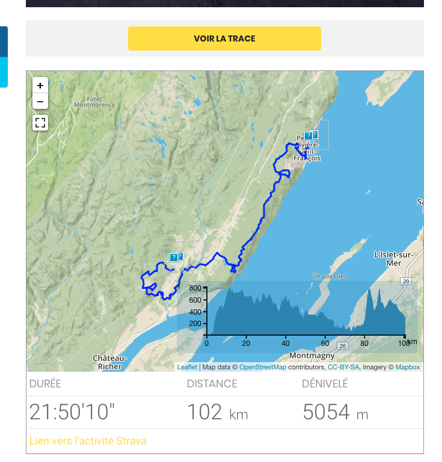

# Strava Parser

Wordpress plugin that show a Strava trace in an article.

## Feature

- Show a box under the article with Elevation containing the Strava Activity GPX
- Provide caching (store the gpx locally)

## Install

Just drop the folder `strava-parser` in `wp-plugins`

Activate the plugin, then setup the following parameters in the plugin configuration (Settings/Strava Parser):
- `MapBox API` is the API key used to show the MapBox map. Get it [here](https://www.mapbox.com).
- `Strava URL Custom Field Name` this is the internal name of the custom field that contains the Strava Activity URL.

The box will appears once you save an activity in an article.

## Thanks

Using [Leaflet](https://leafletjs.com) !

Thanks to [Mapbox](https://www.mapbox.com) for the tiles !
